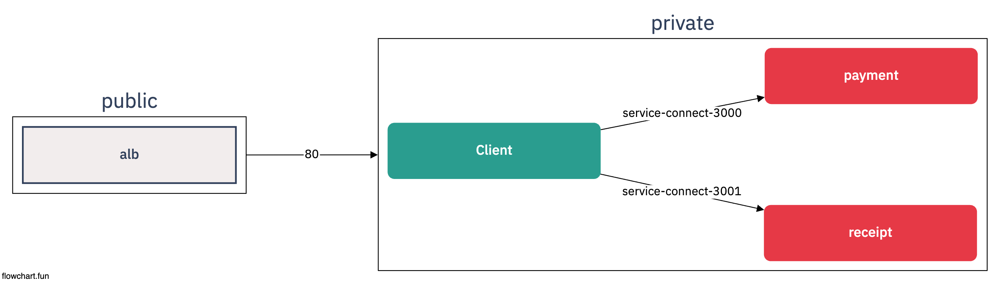

# AWS Copilot Architecture



## Folders 

```sh
    |- applications     ## Applications 
        |- client
        |- payment  
        |- receipt
    |- lib
        |- utils        ##  개발에 필요한 Tools
        |- vpcs         ## VPC Setting
        |- ...
```

## Tech

- AWS CDK + Typescript

    ```sh
        cdk init sample-app --language typescript
        npm run build
        npm run watch
        npm run test
        cdk deploy
        cdk diff
        cdk synth
    ```

- AWS Copilot CLI

    ```sh
        ## install (mac)
        brew install aws/tap/copilot-cli

        cd applications
        copilot init            ## 배포에 필요한 yml 생성 /copilot
        copilot deploy          ## 배포
        copilot app delete      
    ```

    ```sh
        ## 1. Environment 환경을 먼저 정의한 후 배포
        copilot env deploy --name dev

        ## 2. Env를 배포한 후 App 배포
        copilot deploy
    ```

    ```sh
        ## 생성 순서
        APP > Service 
        
        ## 배포 순서
        Env > App > Service

        ## Folders
        |- applicatoins/copilot
            |- environments             ## 각각의 환경자체가 ECS Cluster...
                |- dev          
                |- prod         
                |- staging
            |- client                   ## service
            |- payment                  ## service
            |- receipt                  ## service
            

        ## Command
        1 >> copilot app init
        2 >> copilot env init
        3 >> copilot env deploy --name dev
        4 >> copilot svc init
        5 >> copilot svc deploy --name payment --env dev

        ## 변경사항 없어도 재배포
        copilot dpeloy --force
    ```

- Env 자체가 ECS Cluster
- 기존 Cluster에 넣는건... 불가능?
- Service Connect 특성상 Backend 부터 배포 후 -> Client 배포

## ...

- ECS를 Kubernetes 처럼 쓰는것같은 새로운 방법인것같음

## Reference

- <a href="https://cdkworkshop.com/20-typescript/20-create-project/300-structure.html"> AWS CDK Workshop </a>
- <a href="https://aws.github.io/copilot-cli/docs/getting-started/install/"> AWS Copilot CLI </a>
- <a href="https://github.com/aws-samples/aws-cdk-examples/blob/master/typescript/neptune-with-vpc/neptune-with-vpc-stack.ts"> Typescript CDK Exasmple </a>